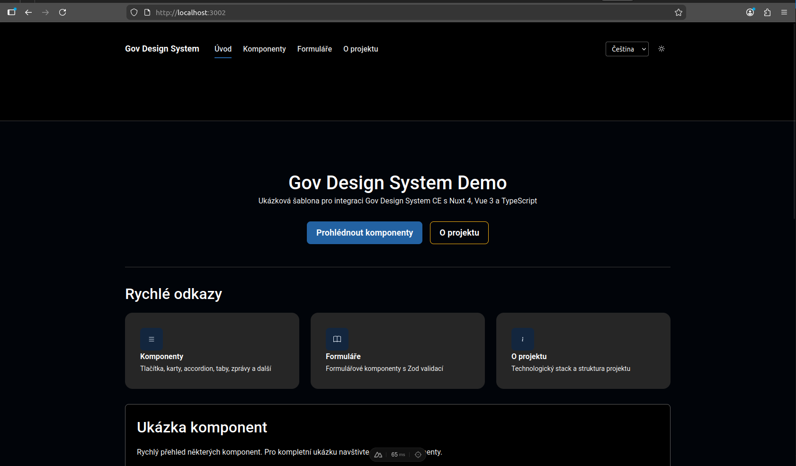

# Gov Design System CE + Nuxt 4

Demo integrace Gov Design System CE s Nuxt 4.




## Napojení komponent

### 1. Instalace

```bash
pnpm add @gov-design-system-ce/components @gov-design-system-ce/styles @gov-design-system-ce/fonts @gov-design-system-ce/icons @gov-design-system-ce/vue
```

### 2. Nuxt konfigurace

```typescript
// nuxt.config.ts
export default defineNuxtConfig({
  css: [
    '@gov-design-system-ce/fonts/lib/roboto.css',
    '@gov-design-system-ce/styles/tokens.css',
    '@gov-design-system-ce/styles/styles.css',
    '@gov-design-system-ce/styles/content.css',
    '@gov-design-system-ce/styles/components.css',
  ],
  build: {
    transpile: ['@gov-design-system-ce/vue'],
  },
  vue: {
    compilerOptions: {
      isCustomElement: (tag) => tag.startsWith('gov-'),
    },
  },
})
```

### 3. Client plugin

```typescript
// app/plugins/design-system.client.ts
import { ComponentLibrary } from '@gov-design-system-ce/vue/dist/plugin'

export default defineNuxtPlugin(({ vueApp }) => {
  window.GOV_DS_CONFIG = {
    iconsPath: '/icons',
    iconsLazyLoad: true,
  }
  vueApp.use(ComponentLibrary)
})
```

### 4. SSR hydratace (volitelné)

```typescript
// server/plugins/design-system.ts
import { renderToString } from '@gov-design-system-ce/components/dist/hydrate'

export default defineNitroPlugin((nitroApp) => {
  nitroApp.hooks.hook('render:response', async (response) => {
    if (!response.body || typeof response.body !== 'string') return

    try {
      const result = await renderToString(response.body)
      response.body = result.html
    } catch (error) {
      // Fallback na client-side hydrataci
    }
  })
})
```

### 5. Použití komponent

Všechny komponenty se importují z `@gov-design-system-ce/vue` a používají PascalCase:

```vue
<script setup>
import { GovButton, GovFormInput, GovMessage } from '@gov-design-system-ce/vue'

const name = ref('')
</script>

<template>
  <GovFormInput v-model="name" placeholder="Jméno" />
  <GovButton color="primary">Odeslat</GovButton>
  <GovMessage color="success">Úspěch</GovMessage>
</template>
```

Sloty se definují HTML atributem `slot=`, ne Vue direktivou `v-slot`:
```vue
<script setup>
import { GovFormControl, GovFormLabel, GovFormInput } from '@gov-design-system-ce/vue'
</script>

<template>
  <GovFormControl>
    <GovFormLabel slot="top">Jméno</GovFormLabel>
    <GovFormInput v-model="name" />
  </GovFormControl>
</template>
```

## Poznámky

- Oficiální design system české státní správy
- Konzistentní vzhled napříč státními weby
- Přístupnost (WCAG 2.1 AA) řešena v komponentách
- Vue wrappery s podporou v-model pro formulářové komponenty
- SSR hydratace renderuje Web Components na serveru (není potřeba `<ClientOnly>`)
- Pod kapotou jsou to Web Components (Stencil.js) - sloty se definují HTML atributem `slot="label"`, ne Vue direktivou `v-slot`
- Vyžaduje `unsafe-inline` v CSP (Stencil.js injektuje styly do Shadow DOM)
- Gov DS nemá samostatnou textarea komponentu - používá se `<GovFormInput :multiline="true" :rows="4" />`

## Spuštění

```bash
pnpm install
pnpm dev
```

## Odkazy

- [Gov Design System](https://designsystem.gov.cz)
- [Nuxt](https://nuxt.com)
